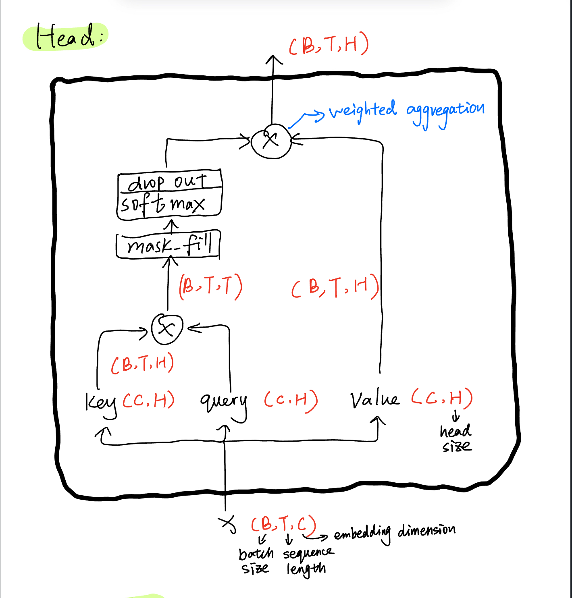
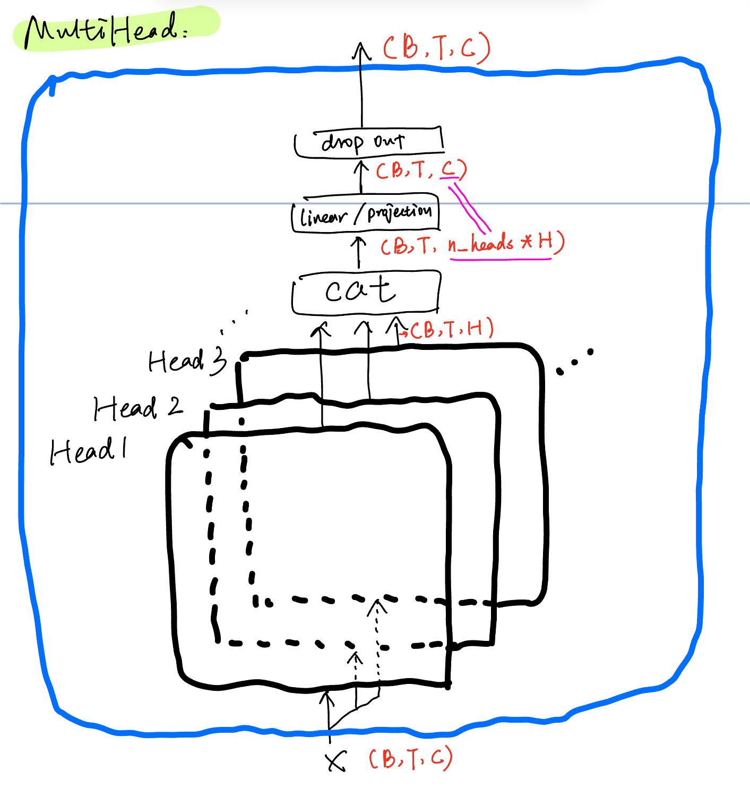
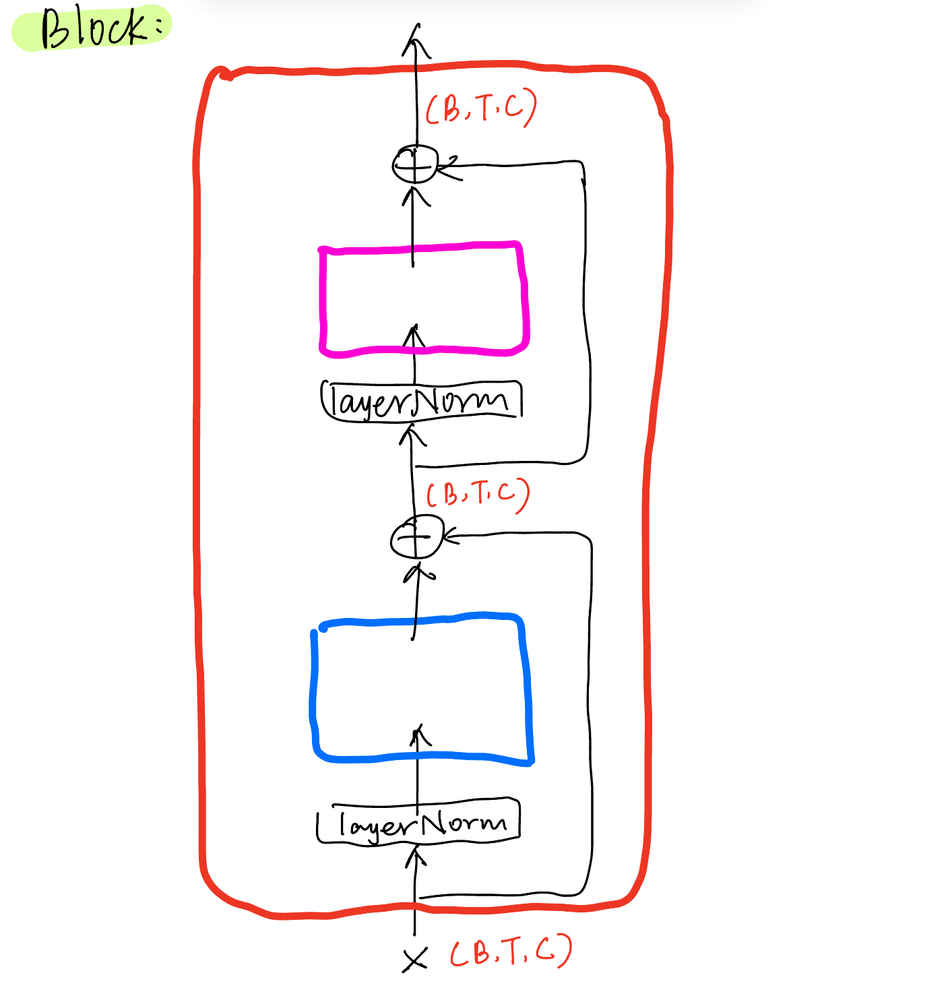
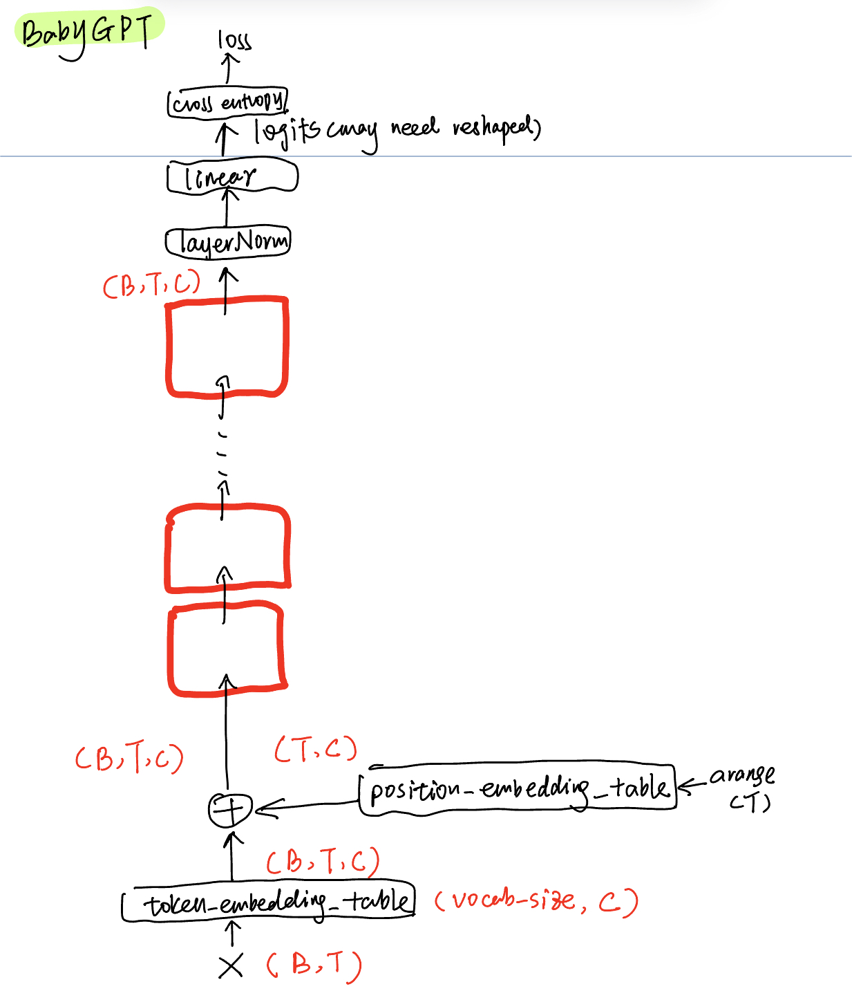
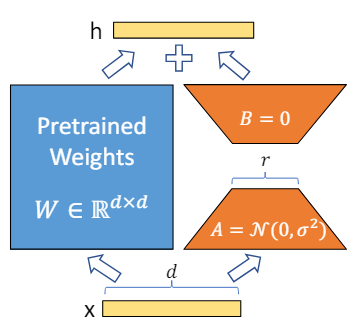
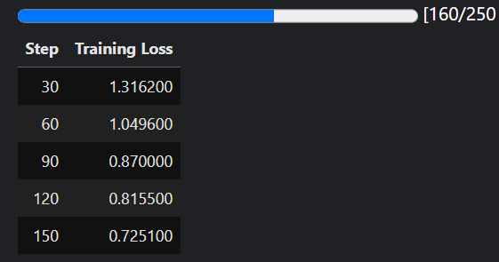

# GPT-and-LLM

## Introduction
In this project, I will implement a simplified version of GPT, which mainly use decoder structure to generate new text file. Then I will do a LoRA fine-tuning on Llama language model. (to be updated)

## Diagram
- Structure that I use in this project:
 1. 

 2. 

 3. 

 4. 

 5. 
 
## Notes

- Use one single character as token unit, which can be modified in other form.
- Generate mapping table from token to index and vice versa. Just sort unique character and then use their index.
- We are concerned about text generation here, which means given some texts what would be the next token (character)? So the input to the GPT is some text and the output will be the next character. For example, given a sentence like "Your name is GPT-3",

```
when input is tensor([6])--'{'Y'}', the target is: [12]--'{'o'}'
when input is tensor([ 6, 12])--'{'Yo'}', the target is: [15]--'{'u'}'
when input is tensor([ 6, 12, 15])--'{'You'}', the target is: [13]--'{'r'}'
```

- For dataloader/batch generation, there are basically two parameters: _batch_size_ (how many independent sequences will we process in parallel) and _block_size_ (what is the maximum context length for predictions). It defines the shape of input (B,T) basically. For example if we generate three batch, we have the following,

```
when input is tensor([0])--' ', the target is: [9]--'i'
when input is tensor([0, 9])--' i', the target is: [14]--'s'
when input is tensor([ 0,  9, 14])--' is', the target is: [0]--' '
when input is tensor([ 0,  9, 14,  0])--' is ', the target is: [3]--'G'
when input is tensor([ 0,  9, 14,  0,  3])--' is G', the target is: [4]--'P'
when input is tensor([10])--'m', the target is: [8]--'e'
when input is tensor([10,  8])--'me', the target is: [0]--' '
when input is tensor([10,  8,  0])--'me ', the target is: [9]--'i'
when input is tensor([10,  8,  0,  9])--'me i', the target is: [14]--'s'
when input is tensor([10,  8,  0,  9, 14])--'me is', the target is: [0]--' '
when input is tensor([14])--'s', the target is: [0]--' '
when input is tensor([14,  0])--'s ', the target is: [3]--'G'
when input is tensor([14,  0,  3])--'s G', the target is: [4]--'P'
when input is tensor([14,  0,  3,  4])--'s GP', the target is: [5]--'T'
when input is tensor([14,  0,  3,  4,  5])--'s GPT', the target is: [1]--'-'
```

- In the first phase, just let the input go through a simple embedding layer (C,C) [C is vocabulary size]. When generating new text, a parameter _max_new_tokens_ denotes how many more characters it will generate. 

- **An important mathematical trick in self-attention**:  Use lower trianguler matrix to achieve weighted aggregation. Each row is like a batch, we only care about using preceding tokens and current token to predict current stuff. So this natural auto-regressive structure can be intuitive. In real implementation, this can be achieved by so called "masked_fill". Each example across batch dimension is of course processed completely independently and never "talk" to each other. In an "encoder" attention block just delete the single line that does masking with tril, allowing all tokens to communicate. **This block here is called a "decoder" attention block** because it has triangular masking, and is usually used in autoregressive settings, like language modeling.

- Attention is a communication mechanism. Can be seen as nodes in a directed graph looking at each other and aggregating information with a weighted sum from all nodes that point to them, with data-dependent weights. Here I make it a little bit simpler. There is rigorously no communication between any two tokens but just some part of them.

- "self-attention" just means that the keys and values are produced from the same source as queries. In "cross-attention", the queries still get produced from x, but the keys and values come from some other, external source (e.g. an encoder module).

- "Scaled" attention additional divides wei by 1/sqrt(head_size). This makes it so when input Q,K are unit variance, wei will be unit variance too and Softmax will stay diffuse and not saturate too much.

- How to set Q,K and V in my project?
```
self.key = nn.Linear(embd_dim, head_size, bias=False)
self.query = nn.Linear(embd_dim, head_size, bias=False)
self.value = nn.Linear(embd_dim, head_size, bias=False)
```

- In the second phase, we just add attention module. Detailed structure can be found in Diagram part.

- LayerNorm and BatchNorm: Horizontal and Vertical difference, to put it simply


## About LoRA (Low-rank Adaption)



- Pre-trained models have a very few intrinsic dimenison (described almost accurately by fewer dimensions). Inspired by this, the author in the original paper hypothesize the updates to the weights also have a low “intrinsic rank” during adaptation.
- For delta weight matrix, do matrix decomposition to save memory (use less information to do almost the same thing). This rank r is a hyperparameter.

## Current status of LLM tuning

