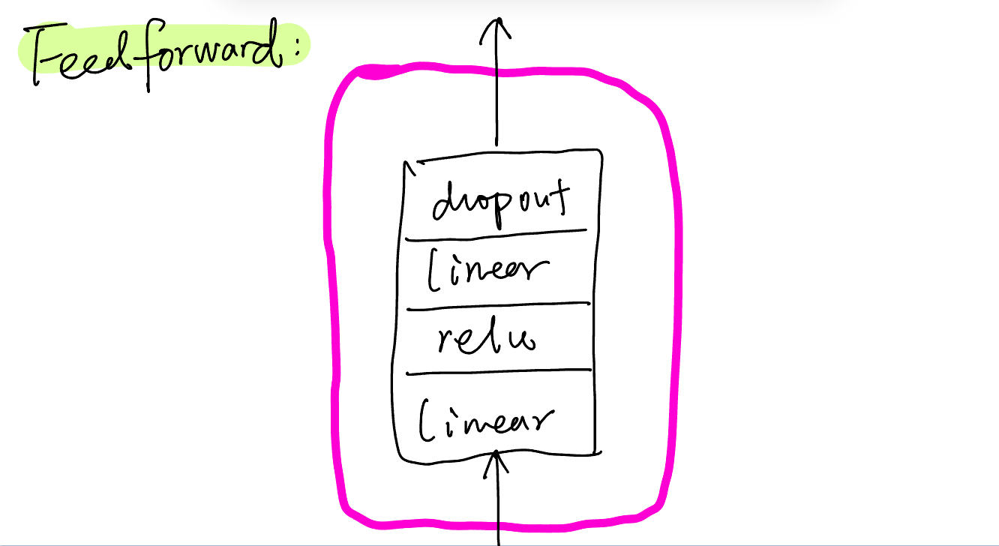

# GPT-and-LLM

## Introduction
In this project, I will implement a simplified version of GPT, which mainly use decoder structure to generate new text file.

## Notes
- LayerNorm and BatchNorm: Horizontal and Vertical difference, to put it simply
  
- Structure that I use in this project:
 1. 

 2. 

 3. 

 4. 

 5. 

- Use one single character as token unit, which can be modified in other form.
- Generate mapping table from token to index and vice versa.
- We are concerned about text generation here, which means given some texts what would be the next token (character)? So the input to the GPT is some text and the output will be the next character. For example, given a sentence like "Your name is GPT-3",

```
when input is tensor([6])--'{'Y'}', the target is: [12]--'{'o'}'
when input is tensor([ 6, 12])--'{'Yo'}', the target is: [15]--'{'u'}'
when input is tensor([ 6, 12, 15])--'{'You'}', the target is: [13]--'{'r'}'
```

## Conclusion
